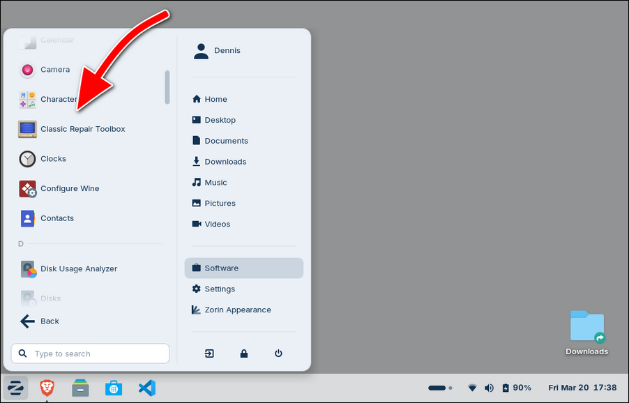

# Installing application in Linux

Go to [Documentation index](./README.md).

As per default the _CRT_ binary Linux package is a one-large package that can be run directly from wherever you have downloaded it - it will not install the executable(s) to anywhere else (but it will install the data).

If you want to have the _CRT_ application and icon available in your "Start" menu (not sure what this is called in Linux?), then you can install it with an application manager like e.g. **Gear Lever**. Just open **Gear Lever** and drag the _CRT_ file in to it, and afterwards you will be able to access it nice and easily:

